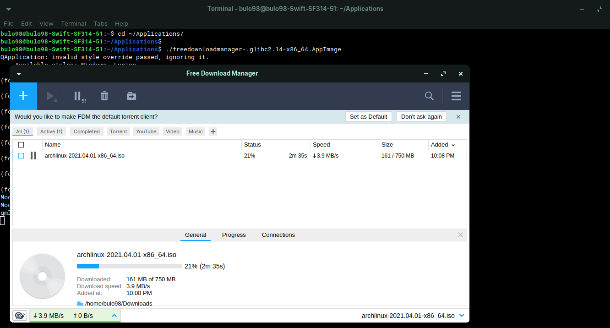

# Free Download Manager AppImage

Free Download Manager is a download manager for Windows, macOS, Linux and Android. For Linux, the company only offers a Debian binary.

FDM was initially proprietary software, but was free and open-source software between versions 2.5 and 3.9.7. Starting with version 3.0.852 (15 April 2010), the source code was made available in the project's Subversion repository instead of being included with the binary package. This continued until versions 3.9.7 .The source code for version 5.0 and newer is not available and the GNU General Public License agreement has been removed from the project. Because this, I cannot provide you with releases of FDM AppImages. Instead you could easily build AppImages for personal use with the above recipe file and instructions on any Linux distribution.

## Tested on

- Ubuntu 16.04 / 18.04 / 20.04 / 20.10
- Debian 9 / 10 / 11 / sid (unstable)
- Fedora 33-1.2, 38
- Arch Linux (Manjaro - 21.0.1)

## Dependencies

`git wget dpkg dpkg-deb imagemagick wget sed cut file desktop-file-validate binutils`

Most of these dependencies are already satisfied if you are running a Debian or Ubuntu based desktop Linux distribution. For instance, Manjaro only needed strings from `binutils` to compile the AppImage.

## Instructions

Run `bash <(curl -sSL https://raw.githubusercontent.com/gauthamp10/freedownloadmanager-linux-appimage/main/freedownloadmanager.sh)` in your terminal.

## Author

**Gautham Prakash**

- Other projects: [github.com/gauthamp10](https://github.com/gauthamp10)

- Website: [gauthamp10.github.io](https://gauthamp10.github.io)

## License

This project is licensed under the MIT License - see the [LICENSE](LICENSE) file for details.
